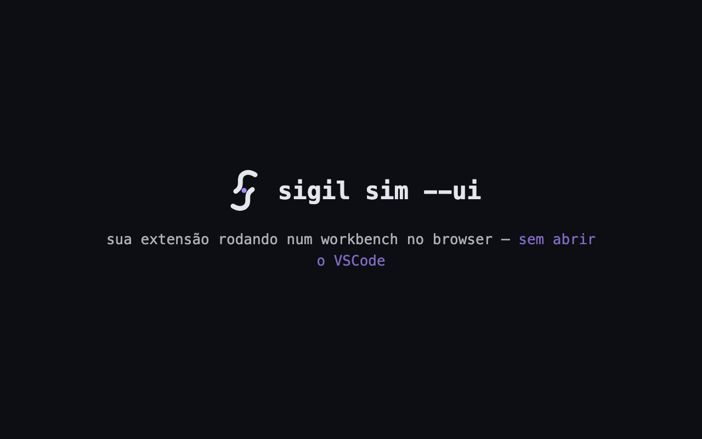
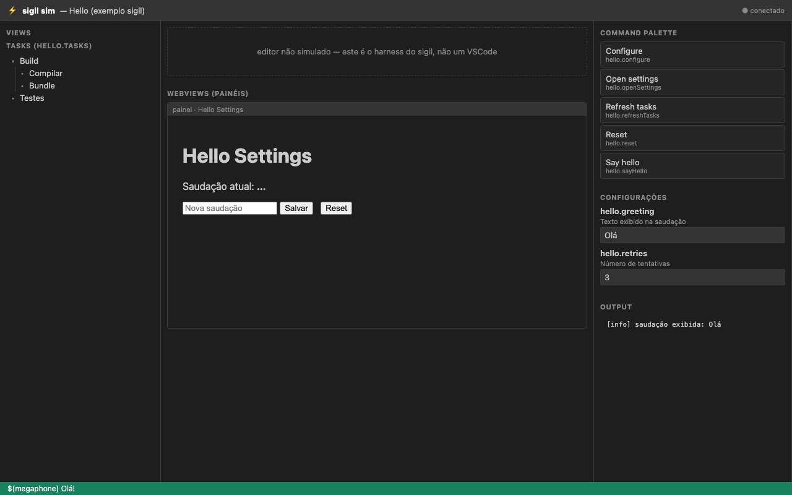

<p align="center">
  <picture>
    <source media="(prefers-color-scheme: dark)" srcset="assets/logo/sigil-logo-dark.svg">
    
  </picture>
</p>

<p align="center">
  <strong>Framework declarativo para extensões do VSCode.</strong><br>
  O TypeScript é a fonte única de verdade; o <code>package.json</code> é derivado dele.<br>
  <em>O único build que pega um typo numa expressão <code>when</code>.</em>
</p>

<p align="center">
  <a href="https://www.npmjs.com/org/sigilkit"></a>
  <a href="https://github.com/JonathanSantos/sigilkit/actions/workflows/ci.yml"></a>
  <a href="LICENSE"></a>
</p>

---

```ts
import * as vscode from "vscode";
import { Extension, Command, Config, Watch } from "@sigilkit/core";

@Extension({ prefix: "hello" })
export class HelloExtension {
  @Config({ description: "Texto exibido na saudação" })
  accessor greeting: string = "Olá";

  @Command({ title: "Say hello", category: "Hello", keybinding: "ctrl+alt+h" })
  sayHello() {
    vscode.window.showInformationMessage(`${this.greeting}!`);
  }

  @Watch("greeting")
  onGreetingChanged(next: string, prev: string) {}
}
```

Nenhuma linha de `contributes` é escrita à mão. `sigil build` gera:

- o bloco `contributes` no `package.json` (merge — chaves não gerenciadas são preservadas);
- `src/.generated/wire.ts` — o `activate()` real, que faz o join entre as chaves
  emitidas pelo compilador e os handlers registrados em runtime, e **lança erro**
  se faltar handler;
- `src/.generated/config.d.ts` — tipos por chave: `getConfig("hello.retries")`
  → `number`, com autocomplete; chave fora do registro retorna `unknown`.

Renomear um comando e esquecer o manifesto deixa de ser um comando fantasma —
vira **erro de build com posição no arquivo**. Um typo numa expressão `when`,
que falharia em silêncio para sempre, vira um erro de build (`SIGIL1018`) com
caret na linha.

## Em 30 segundos

Hot reload no workbench do `sigil sim --ui`: um comando executa, o handler é
editado, e o comportamento novo já vale — **sem F5, sem abrir o VSCode**:

<p align="center">
  
</p>

## Por que sigil

- **Uma fonte de verdade** — identidade (ids, títulos, schemas) sai da AST em
  build time; comportamento (handlers) sai do registry em runtime; o join por
  chave estável é verificado nas duas pontas.
- **Erros altos, nunca silêncio** — handler ausente lança na ativação;
  exceção em comando vira log com stack + notificação "Abrir logs"; API não
  simulada no teste lança erro descritivo.
- **Dev loop de segundos, não de F5** — quatro marchas: watch incremental,
  simulador com REPL, workbench visual no browser e VSCode real com hot swap.
- **Testável por padrão** — `@sigilkit/test` ativa o bundle real da extensão sem
  extension host; os exemplos e o próprio tutorial rodam no CI.
- **Web-ready e minificação-safe** — runtime sem `node:*` (funciona no
  vscode.dev) e join por `Symbol.metadata` (sem `--keep-names`).

## Como se compara

O vizinho mais próximo é o [reactive-vscode](https://github.com/KermanX/reactive-vscode),
que ataca o **runtime**: reatividade estilo Vue por cima da API de eventos e
disposables. O sigil ataca a **identidade**: manifesto, `activationEvents`,
tipos de config e expressões `when` derivados do código e verificados no
build. As teses são complementares — a pergunta que decide é qual é a sua dor:
ergonomia de runtime, ou manter `package.json`, schema e `when` sincronizados
na mão. E a parte que nenhuma outra ferramenta (nem o próprio VSCode) oferece
é estrutural: **validar `when`/`enablement` em build time exige ver as context
keys declaradas E as expressões ao mesmo tempo** — só quem deriva o manifesto
do código tem os dois lados.

## Começando

Os pacotes estão no npm sob o escopo [`@sigilkit`](https://www.npmjs.com/org/sigilkit):

```bash
npm i -D @sigilkit/cli
npx sigil init minha-extensao
cd minha-extensao && npm install && npm run build
# abra no VSCode e aperte F5 — ou: npx sigil sim --ui .
```

**Siga o [tutorial: sua primeira extensão em 5 minutos](docs/tutorial.md)** —
comando, config, status bar, watch, aba de opções e `.vsix`, sem abrir o
VSCode. O teste `tests/tutorial.test.ts` garante que ele nunca apodrece.

Neste monorepo:

```bash
npm install && npm run build     # compila os quatro pacotes
npm test                         # unidade + simulador + E2E do CLI
```

## Os decorators

| Decorator | Em | O que declara |
|---|---|---|
| `@Extension({ prefix?, settings? })` | classe | a extensão; `settings: true` gera a aba de opções (`<prefix>.configure`) |
| `@Command({ title, keybinding?, menus?, enablement?, progress? })` | método | comando + keybindings + menus; `progress` envolve em `withProgress` (token é o último argumento) |
| `@Config({ description?, ... })` | accessor | configuração — tipo, default e enum saem da declaração TS |
| `@Watch("chave")` | método | reação a mudança de config |
| `@Activate` / `@Deactivate` | método | lifecycle |
| `@StatusBar({ alignment?, command? })` | accessor | item na status bar; atribuir ao accessor atualiza o texto |
| `@On("ns.evento", { debounce? })` | método | evento da API com auto-dispose |
| `@OnFile(glob, kind, { debounce? })` | método | `FileSystemWatcher` declarativo |
| `@UriHandler()` | método | deep links `vscode://…` (+ `activationEvent` automático) |
| `@State("global" \| "workspace")` | accessor | persistência em `Memento`, tipada |
| `@Secret()` | accessor | `SecretStorage` com cache síncrono |
| `@ContextKey()` | accessor | `setContext` ao atribuir — e habilita a validação de `when` |
| `@TreeView({ name, container? })` + `@TreeRoot`/`@TreeChildren`/`@TreeItem` | classe | view na sidebar com `TreeDataProvider` adaptado |
| `@Webview({ title, ui, location? })` + `@OnMessage`/`@OnRequest` | classe | painel ou sidebar com shell HTML (CSP + nonce) e RPC tipado |
| `@Language({ id })` + `@Hover`/`@Completion`/`@CodeLens`/`@Diagnostics` | classe | providers de linguagem (+ `onLanguage:*` automático) |
| `@ChatParticipant({ id, name })` + `@ChatRequest`/`@ChatFollowups` | classe | participante de chat (`@nome` no Copilot Chat) |
| `@CustomEditor({ id, filenamePattern, ui })` | classe | editor custom sobre o shell de webview, com `applyEdit` undo-friendly |

## Superfícies de linguagem, chat e editores

```ts
@Language({ id: "markdown" })
export class MarkdownAssist {
  @Hover()                                   hover(doc, pos) { return new vscode.Hover("…"); }
  @Completion({ triggerCharacters: ["("] })  complete(doc, pos) { /* … */ }
  @Diagnostics({ on: "change" })             validate(doc) { return [/* Diagnostic[] */]; }
}
```

O sigil emite os `activationEvents: onLanguage:<id>` (gerencia só o subconjunto
`onLanguage:*` — o resto do array é seu), registra os providers com dispatch
dinâmico (hot-swappáveis) e cuida do ciclo de vida do `DiagnosticCollection`:
revalida em change/save/open e limpa no close.

```ts
@ChatParticipant({ id: "guru", name: "guru" })
export class Guru {
  @ChatRequest()
  async responder(request, ctx, stream, token) { stream.markdown("…"); }
}
```

Entra em `contributes.chatParticipants`; a API de chat é acessada
dinamicamente — não exige `@types/vscode` novo de quem não usa chat, e em
hosts antigos o bind falha alto com mensagem clara.

```ts
@CustomEditor({ id: "caps", displayName: "CAPS", filenamePattern: "*.caps", ui: "./ui/editor.html" })
export class CapsEditor {
  @OnMessage("gritar")
  gritar(_v: unknown, editor: SigilEditorContext) {
    void editor.applyEdit(editor.getText().toUpperCase());  // undo funciona (WorkspaceEdit)
  }
}
```

Handlers recebem o contexto do documento como segundo argumento; a UI recebe o
conteúdo no load e a cada mudança (`onDocument` em `@sigilkit/core/ui`).

## `when` validado no build

A feature que só o sigil pode ter: o compilador vê as `@ContextKey` declaradas
**e** as expressões `when`/`enablement`. Token com o seu prefixo que não é uma
context key, view ou comando declarado → `SIGIL1018` com caret na linha.
Sintaxe inválida (`&&&`, parênteses desbalanceados) → `SIGIL1019`.

```ts
@ContextKey() accessor pronto = false;

@Command({ title: "Sync", enablement: "hello.pronto" })   // ✓ validado
sync() { /* … */ }
```

## Plataforma de runtime

Além dos decorators, o `@sigilkit/core` traz a base que toda extensão reescreve:

- **Logs** — `log.info/warn/error/debug/trace` sobre `LogOutputChannel` (nível
  controlado pelo usuário); funciona antes da ativação (buffer).
- **Erros nunca somem** — todo comando/watch/webview/tree passa por `guard()`:
  erro vira log com stack + notificação com botão "Abrir logs"; trees degradam
  para item de aviso.
- **HTTP** — `http.get/post/…` sobre o fetch global: JSON automático, timeout,
  `HttpError` com status/corpo, `http.fetchImpl` trocável em teste.
- **Recursos** — `resources.readText/readJson/readBytes` para arquivos
  empacotados (via `workspace.fs`, funciona no vscode.dev).
- **RPC host↔UI** — `@OnMessage` (fire-and-forget) e `@OnRequest` respondendo
  a `callHost(type, value)` com correlação automática.
- **Wizards e LLM** — `prompt.text/pick/confirm/steps` (ESC volta um passo) e
  `llm.ask/stream` sobre a Language Model API.
- **Aba de configurações pronta** — `@Extension({ settings: true })` gera o
  comando `<prefix>.configure` com formulário derivado do schema das `@Config`.

## Modos de desenvolvimento

| Comando | O que faz | Quando usar |
|---|---|---|
| `sigil build` | AST → IR → manifesto + wire + tipos (cache por hash do IR) | build e CI |
| `sigil check` | falha se o manifesto commitado está stale | guardião no CI |
| `sigil dev` | watch incremental (`ts.createWatchProgram`, rebuilds de ~3ms) | terminal ao lado do editor |
| `sigil sim` | hot reload no simulador `@sigilkit/test` + REPL | testar comportamento sem UI |
| `sigil sim --ui` | workbench visual no browser, estado ao vivo por SSE | ver palette, trees, configs e webviews reais |
| `sigil sandbox` | VSCode **real e isolado** com hot swap sem F5 | fidelidade total |

**`sigil sim`** re-ativa a extensão no simulador a cada salvamento, preservando
configs, e o REPL a exercita ao vivo: `run hello.sayHello`, `set hello.greeting
"Oi"` (dispara `@Watch`), `tree hello.tasks`, `msg`, `input`, `logs`.

**`sigil sim --ui`** abre `http://127.0.0.1:4400`: command palette clicável,
trees com expansão, editor de configs, status bar, toasts, Output — e
**webviews renderizadas de verdade** em iframes com shim de `acquireVsCodeApi`;
`showInputBox`/`showQuickPick` viram modais na página. É um harness visual do
que o simulador modela, não um clone do VSCode — para fidelidade total, use o
sandbox.

<p align="center">
  
</p>

**`sigil sandbox`** baixa um VSCode isolado (user-data e extensões próprios,
zero poluição do seu) e conecta um companion por socket. O watch decide pelo
**hash do IR**: corpo de método mudou → **🔥 hot swap** (~3ms, sem reload de
janela — o companion recarrega o bundle e chama `__sigilHydrate()`); manifesto
mudou → reload de janela automático. Estado de instância zera no swap (como
Fast Refresh); configs e painéis abertos sobrevivem. Requer `node_modules` no
projeto (o bundle deixa `@sigilkit/core` externo para o registry ser singleton
entre swaps).

## Testando sem o VSCode — `@sigilkit/test`

Simulador do subconjunto da API `vscode` que o sigil toca. Ativa o **bundle
real** interceptando `require("vscode")`, semeia os defaults do manifesto e
expõe sondas:

```ts
import { activateExtension } from "@sigilkit/test";

const host = await activateExtension({ projectDir: "examples/hello" });
await host.executeCommand("hello.sayHello");
host.infoMessages;                              // ["Olá!"]
host.configuration.set("hello.greeting", "Oi"); // simula Settings → dispara @Watch
await host.tree("hello.tasks").roots();         // nós da view
host.panel("hello.settings").receive({ type: "save", value: { /* … */ } });
await host.dispose();
```

Fidelidade onde importa (semântica de `affectsConfiguration`, registro
duplicado lança, painel singleton) e honestidade nas bordas: API não simulada
lança erro descritivo em vez de `undefined` silencioso. O que o simulador não
cobre, o E2E cobre no host real: `npm run test:e2e` roda `examples/hello` via
`@vscode/test-electron`.

## Empacotando (`.vsix`)

```bash
npm run package      # dentro do projeto da extensão
```

Roda `vsce package --no-dependencies` (o bundle já embute `@sigilkit/core`). O
`.vscodeignore` gerado pelo `sigil init` exclui fonte/testes e deixa entrar
`out/`, `ui/` e `media/`. O `.vsix` instala via "Install from VSIX…" ou
`code --install-extension`; publicar no Marketplace é `vsce publish`.

## Requisitos do projeto

O `sigil init` já gera tudo assim; para projetos existentes:

- `target: ES2022`, `experimentalDecorators: false`,
  `useDefineForClassFields: true` — decorators **stage 3**; `@Config`,
  `@StatusBar`, `@State`, `@Secret` e `@ContextKey` exigem `accessor`;
- `"include": ["src", "src/.generated/**/*"]` no tsconfig (globs do tsc não
  atravessam diretórios com ponto);
- bundle esbuild com `--target=es2022` (sem isso a sintaxe de decorator fica
  crua no bundle); `--keep-names` **não** é necessário — o join usa
  `Symbol.metadata`, com teste que ativa o bundle minificado para provar;
- `engines.vscode >= 1.75`; chat exige host ≥ 1.90 **em runtime** (não em
  `@types`).

## O monorepo

| Pacote | Papel | Regra inviolável |
|---|---|---|
| [`@sigilkit/core`](packages/core) | runtime — vai para o bundle da extensão | nunca importa `typescript` (R1) nem `node:*` (web-ready) |
| [`@sigilkit/compiler`](packages/compiler) | build time — AST → IR → emitters | nunca importa `vscode` (R2); nunca executa código do usuário (R3) |
| [`@sigilkit/cli`](packages/cli) | orquestração e IO | emitters são puros; todo IO fica aqui (R4) |
| [`@sigilkit/test`](packages/test) | simulador para testes | nunca importa `vscode` nem `typescript` |

As regras são **testadas**: `tests/boundaries.test.ts` extrai imports por AST e
falha o build se alguma for violada. O design completo — modelo de propriedade
(§4), IR, diagnósticos `SIGIL1000`–`SIGIL1019`, armadilhas — está em
[docs/spec.md](docs/spec.md), com as erratas descobertas na implementação ao
final.

## Exemplos

Cada um valida um perfil de DX, e todos têm testes com `@sigilkit/test` — o mesmo
padrão que uma extensão real usaria:

| Exemplo | Perfil | O que exercita |
|---|---|---|
| [examples/counter](examples/counter) | mínimo — 1 classe, 1 arquivo | prefix default, união → enum, min/max, keybinding com `mac` |
| [examples/todos](examples/todos) | TreeView interativa | container próprio na activity bar, estado + refresh via `@Watch`, menu `view/item/context`, `when` auto-escopado |
| [examples/notes](examples/notes) | Webview de sidebar | assets via `asWebviewUri`, RPC tipado com `@OnRequest`, estado que sobrevive a fechar/reabrir |
| [examples/hello](examples/hello) | kitchen sink | tudo junto — inclusive `@Language` — + E2E no extension host real |

## Testes

```bash
npm test             # unidade + simulador + E2E do CLI (inclui os exemplos)
npm run test:e2e     # extension host real (baixa o VSCode na primeira vez)
```

Camadas: fixtures com um caso por diagnóstico (asserção de código **e** linha
do caret), snapshots de IR/emitters, merge de `package.json`, testes de
fronteira R1–R4, E2E do CLI (`init`/`build`/`check` em cópias isoladas), o
simulador sobre o bundle real (inclusive **minificado**), o tutorial pinado, e
o caminho feliz no extension host via `@vscode/test-electron`. O CI roda tudo,
com `sigil check` como guardião de manifesto stale.

## Status

As três fases do spec (núcleo, robustez, UI) estão completas, mais o roadmap
pós-spec: superfícies de linguagem/chat/editores, DX sobre a API de eventos e
estado, plataforma de runtime, os quatro modos de desenvolvimento e o
empacotamento. A [tabela de decorators](#os-decorators) reflete o que está
implementado e testado — hoje o sigil cobre declarativamente a grande maioria
dos tipos de extensão do marketplace.

## Estabilidade

Pré-1.0: a API pública pode mudar entre versões minor (`0.x` → `0.y`), sempre
com nota no [CHANGELOG](CHANGELOG.md) e nas [releases](https://github.com/JonathanSantos/sigilkit/releases).
Os quatro pacotes versionam em **lockstep** — use sempre a mesma versão de
todos. A partir do `1.0.0`, semver estrito.

## Licença

[MIT](LICENSE)
